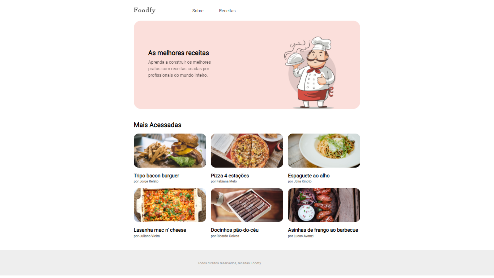
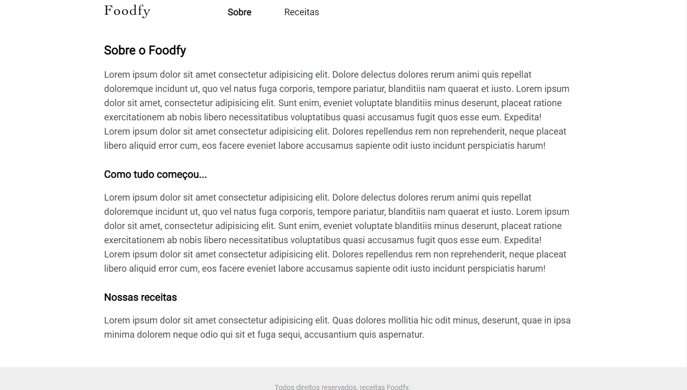
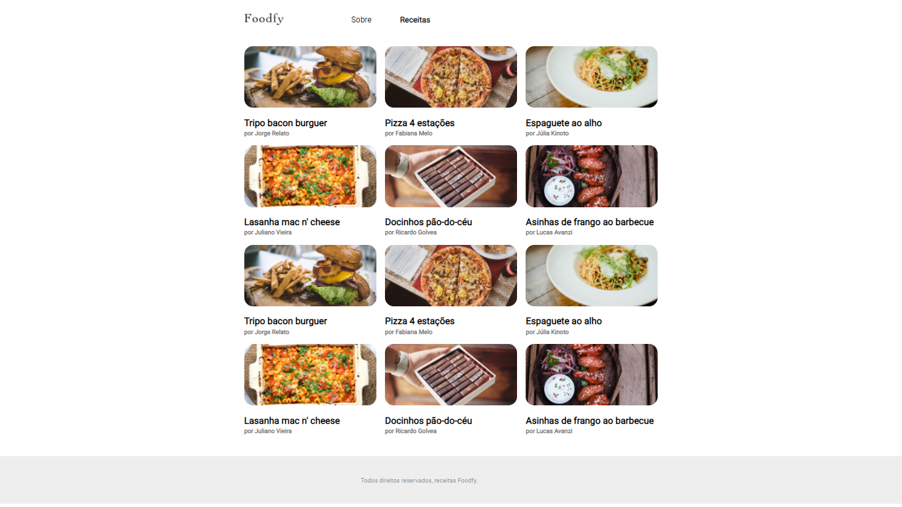
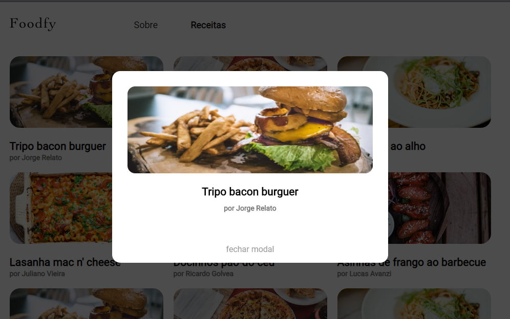

# :sparkles: Projeto Foodfy, seu site de receitas 
* Ongoing project

### Sobre o desenvolvimento
* É uma aplicação web inicialmente muito simples, onde fora usado somente HTML, CSS e JavaScript. Mais para frente pretendo reestruturar todo esse projeto, construindo o backend utilizando Node, frameworks, banco de dados e padrão arquitetural MVC

### Screenshots das telas

:rocket:

:rocket:

:rocket:

